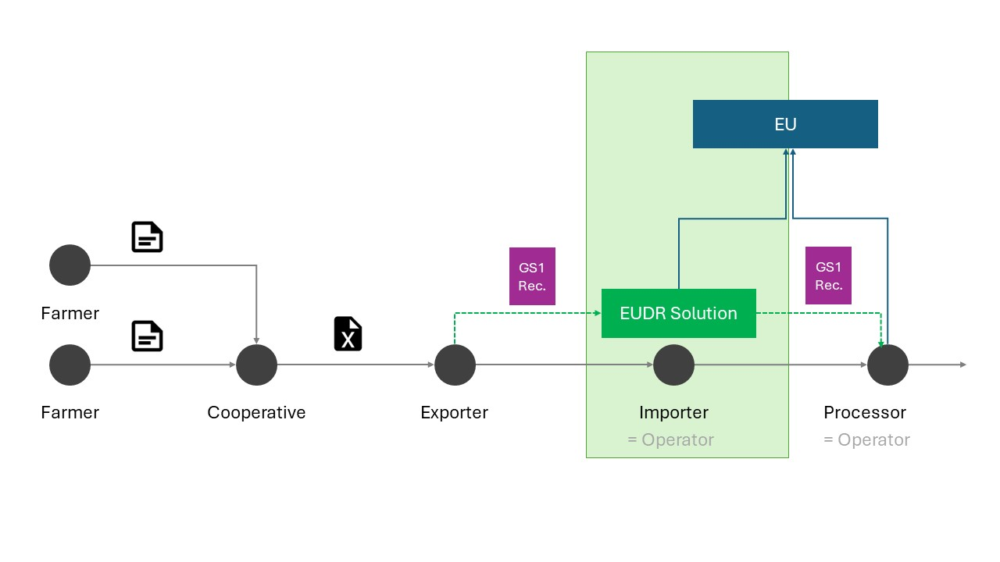
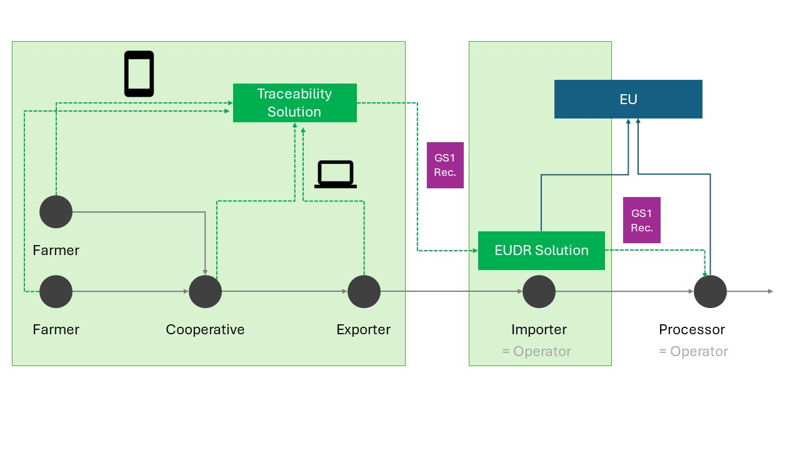
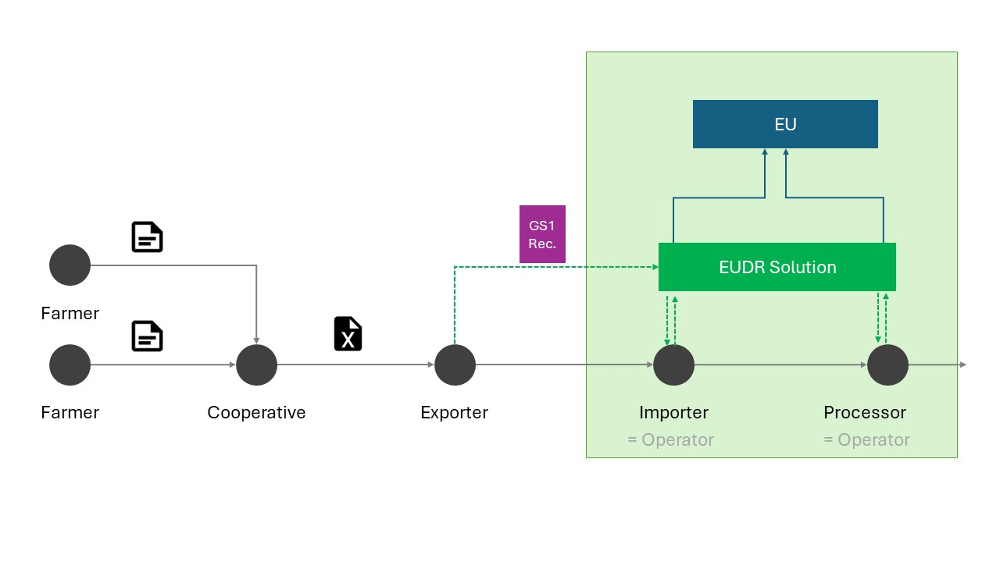
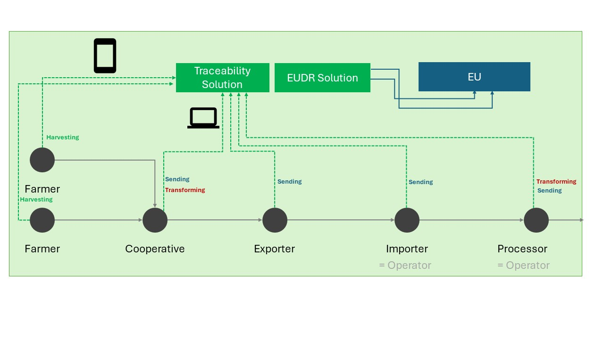
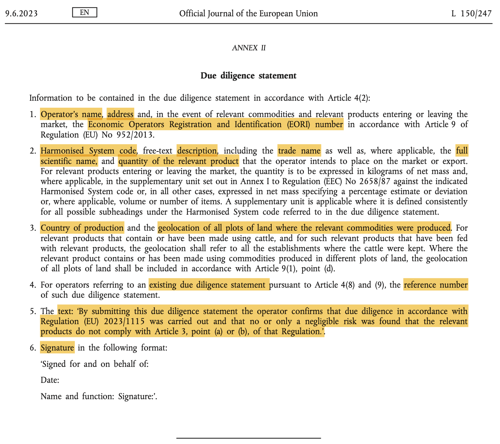

<p align="left"></p>
<br>

# Green Paper: How GS1 Standards can help to meet the EU Deforestation Regulation

GS1 Germany Green Paper on how meeting the requirements of the EUDR can be supported with GS1 standards.

")

## Disclaimer

THIS DOCUMENT IS A GS1 GERMANY GREEN PAPER ONLY, NOT A RATIFIED APPLICATION STANDARD OR IMPLEMENTATION GUIDELINE APPROVED BY ANY GS1/GS1 GERMANY BOARD OR COMMITTEE. ITS PURPOSE IS TO STIMULATE DISCUSSION AND TO PAVE THE WAY FOR DEVELOPING A SOLUTION APPROACH FOR MEETING EUDR REQUIREMENTS USING GS1 STANDARDS. IT ALSO AIMS TO CONTRIBUTE TO FUTURE GS1 STANDARDISATION EFFORTS IN THIS AREA.

## Status of this document

DRAFT

## Introduction

### Synopsis of the EUDR

The Regulation (EU) 2023/1115 targets deforestation and forest degradation, underscoring the value of forests and the urgency to address global deforestation. It recognises the EU's contribution to this issue through its consumption patterns and advocates for regulatory actions to minimise the EU's deforestation impact. The regulation mandates sustainable and deforestation-free production of commodities and products, including due diligence, risk assessment, and supply chain transparency. It also stipulates enforcement and penalties for non-compliance, and emphasises the EU's dedication to international collaboration for a global approach against deforestation.

### Affected commodities and products

The EU regulation on deforestation covers the following seven relevant commodities (see e.g. EU 2023, § 1.1):

1. Oil palm
2. Soya
3. Wood
4. Cocoa
5. Coffee
6. Cattle
7. Rubber

The regulation also affects all products explicitly listed in Annex I "...that contain, have been fed with or have been made using [the above mentioned] relevant commodities" (EU 2023, § 2.2).

Therefore, if a company, for instance,  imports cocoa butter, fat or oil into the EU, it must comply with this regulation.

### Affected parties

***Operators***
Companies that place relevant commodities/products on the Union market or export them. 'Placing on the market’ means the first making available of a relevant commodity or relevant product on the Union market (EU 2023, § 2.15/16).

***Traders***
Any party in the supply chain other than the operator which, in the course of a commercial activity, makes relevant products available on the market (like retail) (EU 2023; § 2.17).

### In scope/out of scope

It is important to note that the EUDR specifies a number of responsibilities for companies placing the mentioned commodities/products into the EU market, most notably (no claim to completeness):

1. Ensure that products are not placed on the market or exported unless they are deforestation-free, produced in accordance with relevant legislation, and covered by a due diligence statement. (EU 2023, § 3)
2. Make available a due diligence statement to the competent authorities while keeping a record of these statements for five years (EU 2023, § 4.1 and § 4.2)
3. Perform due diligence for each affected product/supplier (EU 2023, § 8), including the collection of information, data and documents (EU 2023, § 9), risk assessments (EU 2023, § 10), and risk mitigation measures (EU 2023, § 11).
4. Keep (for five years) all relevant data like product description, quantity, country of production, geolocation of plots where relevant commodities were produced as well as date/time range of harvest/production. (EU 2023, § 9.1)
5. Communicate to operators and to traders further down the supply chain all information necessary to demonstrate that due diligence was exercised and that no or only a negligible risk was found, including the corresponding reference numbers of the due diligence statements. (EU 2023, § 4.7)

Note that trading companies making relevant commodities and products available on the EU market also have to fulfil a number of obligations. The latter are partly similar to the ones stated above.

**In scope:**

1. Solution candidate for passing through EUDR-relevant data between affected parties (e.g. from an exporter to an importer) in a harmonised manner, as required e.g. for information collection, risk assessment and the compilation of the due diligence statement.
2. Solution candidate for exchanging EUDR-relevant data between independent traceability and EUDR systems.
3. Message structure proposal for transmitting dynamic data (e.g. quantity, country of production, geolocation) as required in EU (2023) § 9.
4. Message structure proposal for transmitting static data (e.g. product name and description or name and postal address of operators) as required in EU (2023) § 9.

**Out of scope:**

1. Advice regarding the collection of information, data and documents as per EU (2023) § 9 as such.
2. Specification of upstream or downstream traceability data structures (e.g. EPCIS events).
3. Advice regarding risk assessment as per EU (2023) § 10.
4. Procedures and measures for risk mitigation as per EU (2023) § 11.
5. Specification of the EU Due Diligence Statement message.
6. Mapping of GS1 data structures to the EU Due Diligence Statement.
7. Questionnaire for suppliers for gathering relevant data.
8. Concrete system architecture (e.g. authorisation, authentication).
9. Technical implementation considerations (e.g. system design).
10. Non-functional requirements (e.g. usability, performance).
11. Any other subject not explicitly mentioned to be in scope.

Note that GS1/GS1 Germany may provide support regarding several of the above-mentioned out of scope matters in future documents or standardisation activities.

## Potential solution approach

### Overview

The suggested solution approach aims at contributing to make it as easy and efficient for affected companies to meet the EUDR. In a nutshell, the recommended data structures may be applied whenever there is a need to share EUDR-relevant data between different companies and information systems. A common data sharing approach can save affected parties significant time and costs.

At its core, GS1's recommendation is about a concise electronic message ('EPCIS Origin Declaration Event') for transmitting dynamic data, which should be accompanied by an appropriate means to share master data.

The following illustrations help to understand in which cases the solution approach candidate (referred to as 'GS1 Rec.') is applicable.

#### Case 1: Party which needs to receive and hand over EUDR-relevant data

When e.g. an importing company (operator) needs to gather data related to the EUDR regarding the origin of products, it may request this information from its suppliers through the use of GS1 data structures as recommended in this document, in particular an EPCIS Origin Declaration Event (supplemented by corresponding master data exchange). This allows the operator to conduct risk assessments and mitigation measures for the products' origins, and to submit a due diligence statement to the EU platform.

This standardised communication method benefits suppliers by shielding them from the need to adapt to various proprietary data sharing mechanisms. Moreover, the importing company is required to provide its Due Diligence Statement reference number and all pertinent origin data to its customers. For this purpose, the company can again utilise the EPCIS Origin Declaration Event, ensuring a standardised way of communicating with its customers.


*Figure 1: Application scenario 1*

#### Case 2: Several systems requiring to share EUDR-relevant data

In this context, we are considering a situation where there is a traceability system in place in the upstream supply chain. Such a system could be managed by third party solution providers, government agencies, or organisations responsible for certification and quality control. The EUDR-relevant data can be gathered and shared using the EPCIS Origin Declaration Event (supplemented by corresponding master data exchange). Therefore, this recommendation may help to enhance interoperability among various systems for traceability, transparency, and compliance with the EUDR that are used throughout value networks.


*Figure 2: Application scenario 2*

#### Case 3: Operators sharing the same EUDR solution

This scenario is applicable if affected downstream parties utilise a community-based EUDR solution. In such a system, pertinent data on product origin and risk assessments can be shared through cloud-based services among (entitled) members. However, to ensure seamless connectivity and data coherence between the upstream and downstream supply chain, it is crucial to employ standardised data structures as suggested in this document. This would ensure that information flows efficiently across the entire supply chain (e.g. through reducing the risk of discrepancies and errors in data transmission).


*Figure 3: Application scenario 3*

#### Case 4: One common traceability and EUDR system used by all parties concerned

In this last scenario (though rather unlikely for the foreseeable future), all affected stakeholders in the supply chain, ranging from the farmer to the retailer, utilise a unified system for traceability and EUDR compliance. Under these circumstances, the need for a standardised data exchange might become redundant, as relevant traceability data (most notably, EPCIS events) is already captured and shared within this unified system. Additionally, the Due Diligence Statement reference numbers for companies operating within the EU could be conveyed in e.g. EPCIS Shipping or Transformation events. This comprehensive approach would ensure that all required origin data for meeting the obligations of operators and traders (including processing and (dis)aggregation processes) are collected systematically, thereby facilitating a holistic view of compliance and traceability across the entire supply chain.


*Figure 4: Application scenario 4*

### Due Diligence Statement

The following EUDR excerpt shows the required content of the Due Diligence Statement. Note that the statement as such does not contain all data affected parties are required to collect and/or record:


*Figure 5: Due Diligence Statement as per EU (2023), Annex II*

### Master data vs. event data

Data as required by the EUDR can be grouped into two categories:

- *Dynamic:* (Visibility) event data
- *Static:* Master Data for products, organisations, and locations

The following sections provide guidance on how this data may be shared by leveraging GS1 data structures.

### Event data

Event data are records of the completion of business process steps in which physical or digital entities are handled. It confirms the carrying out of a physical process or a comparable digital process. (GS1 2023c, 6.1.3)

#### Preliminary remark

Note that the specified EPCIS event structure contains user extension fields and user vocabulary elements. The latter are declared or formed by using the `example` namespace. In other words, they are not yet standardised.

Once the EPCIS event message structure (including its fields and values) is formally standardised, e.g. in a GS1 application standard, any documentation or implementation referring to it should be updated accordingly.

#### Event data structure

The type of the [EPCIS event](https://ref.gs1.org/epcis/EPCISEvent) to be used for the EPCIS Origin Declaration Event is an [ObjectEvent](https://ref.gs1.org/epcis/ObjectEvent).

Each EPCIS event relates to one specific product.

The following table defines the content of the EPCIS Origin Declaration Event:

| Field name             | Data type              | Description                    |
| ---------------------- | ---------------------- | ------------------------------ |
| eventTime              | Date and Time Stamp    | (Required) See [epcis:eventTime](https://ref.gs1.org/epcis/eventTime)    |
| eventTimeZoneOffset    | String                 | (Required) See [epcis:eventTimeZoneOffset](https://ref.gs1.org/epcis/eventTimeZoneOffset)   |
| action                 | Code value (`OBSERVE`) | (Required) See [epcis:action](https://ref.gs1.org/epcis/action)    |
| bizStep | BizStep URI (`https://example.com/bizStep/declaring_origin`) | (Required) See [epcis:bizStep](https://ref.gs1.org/epcis/bizStep)   |
| readPoint              | Place (Wrapper)         | (Optional) See [epcis:readPoint](https://ref.gs1.org/epcis/readPoint)   |
| _id                    | Location ID (GS1 Digital Link URI) | (Required) |
| bizTransactionList     | List of BizTransactions | (Optional) See [epcis:bizTransactionList](https://ref.gs1.org/epcis/bizTransactionList)     |
| _type                  | Business Transaction Type ID (URI) | (Optional) See [epcis:bizTransactionType](https://ref.gs1.org/epcis/bizTransactionType)   |
| _bizTransaction        | BizTransaction ID (URI) | (Required) See [epcis:BizTransaction](https://ref.gs1.org/epcis/BizTransaction)   |
| quantityList           | List of QuantityElements | (Required) See [epcis:quantityList](https://ref.gs1.org/epcis/quantityList)   |
| _QuantityElement       | Wrapper                | (Required) See [epcis:QuantityElement](https://ref.gs1.org/epcis/QuantityElement)   |
| __epcClass             | Class-level ID (GS1 Digital Link URI) | (Required) See [epcis:epcClass](https://ref.gs1.org/epcis/epcClass)   |
| __quantity             | Decimal                | (Required) See [epcis:quantity](https://ref.gs1.org/epcis/quantity)   |
| __uom                  | UN/CEFACT Rec. 20 Unit Code | (Optional) See [epcis:uom](https://ref.gs1.org/epcis/uom)   |
| harvestDate            | Date                   | (Conditional) The harvest date (mutually exclusive to `harvestDateStart` and `harvestDateEnd`) |
| harvestDateStart       | Date                   | (Conditional) The harvest start date (to be used with `harvestDateEnd`, mutually exclusive to `harvestDate`) |
| harvestDateEnd         | Date                   | (Conditional) The harvest end date (to be used with `harvestDateStart`, mutually exclusive to `harvestDate`) |
| eoriNumber             | String | (Optional) Economic Operators' Registration and Identification number |
| partyGLN               | String                 | (Optional) 13-digit GLN that is being used to identify the legal entity of the declaring party |
| hsCode                 | String | (Optional) Harmonized System Code |
| countryList            | List of CountryCodes   | (Optional) |
| _countryCode           | Code value (ISO 3166 Alpha-2) | (Required) A short text string code specifying a country |
| originList             | List of OriginDetails  | (Required) |
| _originDetails         | Wrapper | (Required) Structure comprising origin details |
| __geofence             | String | (Conditional) Area polygon (geofence) as specified in CBV 2.0, 9.3.1, consisting of an array of longitude-latitude-coordinates (mutually exclusive to `geolocation`) |
| __geolocation          | URI (Geo URI)          | (Conditional) Geographic coordinates, expressed as a Geo URI according to RFC 5870 (mutually exclusive to `geofence`) |
| __areaSize             | Wrapper | (Optional) Quantitative value to specify a field's area size, consisting of a point value and a unit of measurement |
| ___value               | Float | (Required) A floating-point numeric value that is qualified by the corresponding measurement unit code |
| ___unitCode            | UN/CEFACT Rec. 20 Unit Code | (Required) A string value indicating a Measurement Unit from UN/ECE Recommendation 20 |
| __producerIdentification | Wrapper               | (Required) |
| ___type                | Producer Identification Type ID (URI) | (Required) |
| ___id                  | String | (Required) |

#### EPCIS 2.0 JSON/JSON-LD example (non-normative)

```json
{
  "@context": [
    "https://ref.gs1.org/standards/epcis/2.0.0/epcis-context.jsonld",
    {
      "eudr": "https://ns.eudr.example.com"
    }
  ],
  "type": "EPCISDocument",
  "schemaVersion": "2.0",
  "creationDate": "2024-01-20T03:00:00.000+02:00",
  "epcisBody": {
    "eventList": [
      {
        "type": "ObjectEvent",
        "eventTime": "2024-01-20T03:00:00+02:00",
        "eventTimeZoneOffset": "+02:00",
        "action": "OBSERVE",
        "bizStep": "https://example.com/bizStep/declaring_origin",
        "readPoint": {
          "id": "https://id.gs1.org/414/4000001100002"
        },
        "bizTransactionList": [
          {
            "type": "https://example.com/btt/dueDiligenceStatementNumber",
            "bizTransaction": "https://epcis.example.com/user/vocab/bt/DDS.123"
          },
          {
            "type": "po",
            "bizTransaction": "urn:epcglobal:cbv:bt:4000001000005:PO12345"
          }
        ],
        "quantityList": [
          {
            "epcClass": "https://id.gs1.org/01/04000044001236/10/BATCH123",
            "quantity": 50,
            "uom": "KGM"
          }
        ],
        "eudr:harvestDateStart": "2024-01-20",
        "eudr:harvestDateEnd": "2024-01-18",
        "eudr:eoriNumber": "DE12345678912345",
        "eudr:partyGLN": "https://id.gs1.org/417/4000001000005",
        "eudr:hsCode": "18040000",
        "eudr:countryList": [
          {
            "eudr:countryCode": "CO"
          }
        ],
        "eudr:originList": [
          {
            "eudr:originDetails": [
              {
                "eudr:geofence": "[[6.898247,50.942499], [6.898292,50.942275], [6.898094,50.942263], [6.898126,50.942106], [6.898526,50.942130], [6.898451,50.942512], [6.898247,50.942499]]",
                "eudr:areaSize": {
                  "eudr:value": "100",
                  "eudr:unitCode": "HAR"
                },
                "producerIdentification": {
                  "type": "https://example.com/producerIDType:partyGLN",
                  "id": "4012345123456"
                }
              },
              {
                "eudr:geolocation": "geo:50.942499,6.898247",
                "eudr:areaSize": {
                  "eudr:value": "2.5",
                  "eudr:unitCode": "HAR"
                },
                "eudr:producerIdentification": {
                  "type": "https://example.com/producerIDType:organizationName",
                  "id": "Farmer ABC"
                }
              }
            ]
          }
        ]
      }
    ]
  }
}
```

#### EPCIS 2.0 XML example (non-normative)

```xml
<epcis:EPCISDocument xmlns:epcis="urn:epcglobal:epcis:xsd:2" schemaVersion="2.0" creationDate="2024-01-20T03:00:00.000+02:00" xmlns:xsi="http://www.w3.org/2001/XMLSchema-instance" xsi:schemaLocation="urn:epcglobal:epcis:xsd:2 EPCglobal-epcis-2_0.xsd" xmlns:eudr="https://ns.eudr.example.com">
	<EPCISBody>
		<EventList>
			<ObjectEvent>
				<!-- Date and time when declaration was made. Should be equal or lower than harvestEndDate -->
				<eventTime>2024-01-20T03:00:00.000+02:00</eventTime>
				<eventTimeZoneOffset>+02:00</eventTimeZoneOffset>
				<action>OBSERVE</action>
				<bizStep>https://example.com/bizStep/declaring_origin</bizStep>
				<!-- Identifies the declaring party's of business (e.g. headquarters). Usually corresponds with declaration party GLN -->
				<readPoint>
					<id>https://id.gs1.org/414/4000001100002</id>
				</readPoint>
				<bizTransactionList>
					<!-- (Optional) Business Transaction IDs need to be URIs, e.g. URN-based URI or HTTPS URIs. See CBV 2.0, 8.5. for available options. -->
					<bizTransaction type="https://example.com/btt/dueDiligenceStatementNumber">https://epcis.example.com/user/vocab/bt/DDS.123</bizTransaction>
					<!-- (Optional) Business transaction reference(s) e.g., purchase order number for later mapping -->
					<bizTransaction type="https://ref.gs1.org/cbv/BTT-po">urn:epcglobal:cbv:bt:4000001000005:PO12345</bizTransaction>
				</bizTransactionList>
				<!-- Identification of the supplied product via GTIN (and batch) and its quantity -->
				<quantityList>
					<quantityElement>
						<epcClass>https://id.gs1.org/01/04000044001236/10/BATCH123</epcClass>
						<quantity>50</quantity>
						<uom>KGM</uom>
					</quantityElement>
				</quantityList>
				<eudr:harvestDateStart>2024-01-20</eudr:harvestDateStart>
				<eudr:harvestDateEnd>2024-01-18</eudr:harvestDateEnd>
				<!-- (Optional) Own EORI (Economic Operators Registration and Identification) number -->
				<eudr:eoriNumber>DE12345678912345</eudr:eoriNumber>
				<!-- (Optional) Party GLN identifying the declaring party -->
				<eudr:partyGLN>https://id.gs1.org/417/4000001000005</eudr:partyGLN>
				<!-- (Optional) Harmonized System (HS) Code -->
				<eudr:hsCode>18040000</eudr:hsCode>
        <!-- (Optional) List of countries of origin where the geolocations of the producers are located -->
				<eudr:countryList>
					<!-- 1 or more occurrences, ISO 3166-1 Alpha-2, 2-letter country codes -->
					<eudr:countryCode>CO</eudr:countryCode>
				</eudr:countryList>
				<!-- Origin information -->
				<eudr:originList>
					<!-- One or more originDetails containers (one container = one geolocation or polygon) -->
					<eudr:originDetails>
						<!-- Identification of the plot of land via polygon -->
						<!-- See also: https://ref.gs1.org/standards/cbv/#page=118 -->
						<eudr:geofence>[[6.898247,50.942499], [6.898292,50.942275], [6.898094,50.942263], [6.898126,50.942106], [6.898526,50.942130], [6.898451,50.942512], [6.898247,50.942499]]</eudr:geofence>
						<eudr:areaSize>
							<eudr:value>100</eudr:value>
							<eudr:unitCode>HAR</eudr:unitCode>
						</eudr:areaSize>
						<!-- (Conditional) Option 1, preferred: ID such as a party GLN -->
						<eudr:producerIdentification type="https://example.com/producerIDType:partyGLN" id="4012345123456"/>
					</eudr:originDetails>
					<eudr:originDetails>
						<!-- Identification of the plot of land via geolocation -->
						<eudr:geolocation>geo:50.942499,6.898247</eudr:geolocation>
						<eudr:areaSize>
							<eudr:value>2.5</eudr:value>
							<eudr:unitCode>HAR</eudr:unitCode>
						</eudr:areaSize>
						<!-- (Conditional) Option 2: free text, if proper ID (see Option 1 above) is not available -->
						<eudr:producerIdentification type="https://example.com/producerIDType:organizationName" id="Farmer ABC"/>
					</eudr:originDetails>
				</eudr:originList>
			</ObjectEvent>
		</EventList>
	</EPCISBody>
</epcis:EPCISDocument>
```

### Master Data

Master data are descriptive data elements of an entity that are static or nearly so. For a product, for example, master data might include the trade item’s dimensions, descriptive text, nutritional information in the case of a food product, and so on. For a legal entity, master data might include the name of the organisation, its postal address, geographic coordinates, contact information, and so on. (GS1 2023c, 6.1.1)

#### Party master data

According to the EUDR (EU 2023, §9), affected parties need to have a record of "... the name, postal address and email address of any business or person from whom they have been supplied with the relevant products (...) [and] of any business, operator or trader to whom the relevant products have been supplied".

Hence, a simple party master data record for an organisation, identified through a Global Location Number (GLN), may comprise the following data:

| Field name             | Data type              | Description                    |
| ---------------------- | ---------------------- | ------------------------------ |
| organizationName       | Language-tagged string | (Required) See [gs1:organizationName](https://www.gs1.org/voc/organizationName])    |
| partyGLN               | String                 | (Required) See [gs1:partyGLN](https://www.gs1.org/voc/partyGLN)    |
| address                | Address (wrapper)      | (Required) See [gs1:PostalAddress](https://www.gs1.org/voc/PostalAddress)    |
| _streetAddress         | Language-tagged string | (Required) See [gs1:streetAddress](https://www.gs1.org/voc/streetAddress)    |
| _addressLocality       | Language-tagged string | (Required) See [gs1:addressLocality](https://www.gs1.org/voc/addressLocality)  |
| _postalCode            | String                 | (Required) See [gs1:postalCode](https://www.gs1.org/voc/postalCode)       |
| _addressCountry        | Country (wrapper)      | (Required) See [gs1:addressCountry](https://www.gs1.org/voc/addressCountry)   |
| __countryCode          | Code value (ISO 3166 Alpha-2) | (Required) See [gs1:countryCode](https://www.gs1.org/voc/countryCode) |
| contactPoint           | ContactPoint (wrapper) | (Required) See [gs1:contactPoint](https://www.gs1.org/voc/contactPoint) |
| _contactType           | Language-tagged string | (Optional) See [gs1:contactType](https://www.gs1.org/voc/contactType)  |
| _email                 | String                 | (Required) See [gs1:email](https://www.gs1.org/voc/email)  |

The **example (non-normative) JSON-LD data structure** provided below can be implemented across the APIs of the exchanging parties. Given that this master data holds potential relevance for various stakeholders, it would be prudent to make the API endpoints discoverable, for instance, through GS1-compliant Resolvers or the GS1 Registry Platform.

```json
{
    "@context": {
        "gs1": "https://gs1.org/voc/",
        "xsd": "https://www.w3.org/2001/XMLSchema#",
        "@vocab": "https://gs1.org/voc/"
    },
    "@type": "gs1:Organization",
    "@id": "https://id.gs1.org/417/4000001000005",
    "organizationName": [
        {
            "@value": "Example Company",
            "@language": "en"
        }
    ],
    "globalLocationNumber": "4000001000005",
    "address": [
        {
            "streetAddress": [
                {
                    "@value": "Sample Street 123",
                    "@language": "en"
                }
            ],
            "addressLocality": [
                {
                    "@value": "Sample City",
                    "@language": "en"
                }
            ],
            "postalCode": "12345",
            "addressCountry": {
                "countryCode": "DE",
                "@type": "gs1:Country"
            },
            "@type": "gs1:PostalAddress"
        }
    ],
    "contactPoint": [
        {
            "contactType": [
                {
                    "@value": "Customer Support",
                    "@language": "en"
                }
            ],
            "email": "info@example.com",
            "@type": "gs1:ContactPoint"
        }
    ]
}
```

#### Location master data

In addition to party master data, it may also be beneficial to share location master data. For instance, an EUDR system could store/provide the corresponding address data, geo coordinates or polygons of fields to ease data provision. In this spirit, a simple party master data record for a physical location, identified through a Global Location Number (GLN), may comprise the following data:

| Field name             | Data type              | Description                    |
| ---------------------- | ---------------------- | ------------------------------ |
| physicalLocationName   | Language-tagged string | (Required) See [gs1:physicalLocationName](https://www.gs1.org/voc/physicalLocationName)   |
| locationGLN            | String                 | (Required) See [gs1:locationGLN](https://www.gs1.org/voc/locationGLN)    |
| address                | Address (wrapper)      | (Required) See [gs1:PostalAddress](https://www.gs1.org/voc/PostalAddress)    |
| _streetAddress         | Language-tagged string | (Required) See [gs1:streetAddress](https://www.gs1.org/voc/streetAddress)    |
| _addressLocality       | Language-tagged string | (Required) See [gs1:addressLocality](https://www.gs1.org/voc/addressLocality)  |
| _postalCode            | String                 | (Required) See [gs1:postalCode](https://www.gs1.org/voc/postalCode)       |
| _addressCountry        | Country (wrapper)      | (Required) See [gs1:addressCountry](https://www.gs1.org/voc/addressCountry)   |
| __countryCode          | Code value (ISO 3166 Alpha-2) | (Required) See [gs1:countryCode](https://www.gs1.org/voc/countryCode) |
| geo                    | GeoCoordinates or GeoShape | (Required) See [gs1:geo](https://www.gs1.org/voc/geo) |
| _GeoCoordinates        | Latitude/longitude (wrapper) | (Conditional) See [gs1:GeoCoordinates](https://www.gs1.org/voc/GeoCoordinates) |
| __latitude | Float | (Required) See [gs1:latitude](https://www.gs1.org/voc/latitude) |
| __longitude | Float | (Required) See [gs1:longitude](https://www.gs1.org/voc/longitude) |
| _GeoShape | Polygon | (Conditional) See [gs1:GeoShape](https://gs1.org/voc/GeoShape) |
| __polygon | String | (Required) See [gs1:polygon](https://gs1.org/voc/polygon) |

The **example (non-normative) JSON-LD data structure** provided below can be implemented across the APIs of the exchanging parties. Given that this master data holds potential relevance for various stakeholders, it would be prudent to make the API endpoints discoverable, for instance, through GS1-compliant Resolvers or the GS1 Registry Platform.

```json
{
    "@context": {
        "gs1": "https://gs1.org/voc/",
        "xsd": "https://www.w3.org/2001/XMLSchema#",
        "@vocab": "https://gs1.org/voc/"
    },
    "@type": "gs1:Place",
    "@id": "https://id.gs1.org/414/4000001100002",
    "physicalLocationName": [
          {
              "@value": "Example Location One",
              "@language": "en"
          }
      ],
    "locationGLN": "4000001100002",
    "address": [
        {
            "streetAddress": [
                {
                    "@value": "Sample Street 123",
                    "@language": "en"
                }
            ],
            "addressLocality": [
                {
                    "@value": "Sample City",
                    "@language": "en"
                }
            ],
            "postalCode": "12345",
            "addressCountry": {
                "countryCode": "DE",
                "@type": "gs1:Country"
            },
            "@type": "gs1:PostalAddress"
        }
    ],
    "geo": {
        "latitude": {
            "@value": "50.942499",
            "@type": "xsd:float"
        },
        "longitude": {
            "@value": "6.898247",
            "@type": "xsd:float"
        },
        "@type": "gs1:GeoCoordinates"
    }
}
```

#### Product master data

Analogous to party and location master data, it also makes sense to share master data of  affected trade items. A simple party master data record for a product, identified through a Global Trade Item Number (GTIN), may comprise the following data:

| Field name             | Data type              | Description                    |
| ---------------------- | ---------------------- | ------------------------------ |
| productName            | Language-tagged string | (Required) See [gs1:productName](https://www.gs1.org/voc/productName) |
| gtin                   | String                 | (Required) See [gs1:gtin](https://www.gs1.org/voc/gtin) |
| regulatedProductName   | Language-tagged string | (Required) See [gs1:regulatedProductName](https://www.gs1.org/voc/regulatedProductName) |
| productDescription     | Language-tagged string | (Required) See [gs1:productDescription](https://www.gs1.org/voc/productDescription) |
| countryOfOrigin        | Country (wrapper)      | (Optional) See [gs1:countryOfOrigin](https://www.gs1.org/voc/countryOfOrigin) |
| _countryCode           | Code value (ISO 3166 Alpha-2) | (Required) See [gs1:countryCode](https://www.gs1.org/voc/countryCode) |
| hsCode                 | String                 | (Optional) Harmonized System Code |
| scientificName         | String                 | (Required) Scientific name |
| commodityDescription   | Language-tagged string | (Required) Description of commodity |

The **example (non-normative) JSON-LD data structure** provided below can be implemented across the APIs of the exchanging parties. Given that this master data holds potential relevance for various stakeholders, it would be prudent to make the API endpoints discoverable, for instance, through GS1-compliant Resolvers or the GS1 Registry Platform.

```json
{
    "@context": {
        "gs1": "https://gs1.org/voc/",
        "xsd": "https://www.w3.org/2001/XMLSchema#",
        "ex": "https://example.com/voc/",
        "@vocab": "https://gs1.org/voc/"
    },
    "@type": "gs1:Product",
    "@id": "https://id.gs1.org/01/04012345123456",
    "productName": [
        {
            "@value": "Example Cocoa Butter",
            "@language": "en"
        }
    ],
    "gtin": "04012345123456",
    "regulatedProductName": [
        {
            "@value": "Cocoa butter",
            "@language": "en"
        }
    ],
    "productDescription": [
        {
            "@value": "Example cocoa butter is a creamy, vegetable fat extracted from the cocoa bean, renowned for its rich aroma and smooth texture.",
            "@language": "en"
        }
    ],
    "countryOfOrigin": [
        {
            "@type": "gs1:Country",
            "countryCode": "EC"
        }
    ],
    "ex:hsCode": "18040000",
    "ex:scientificName": "Theobroma cacao",
    "ex:commodityDescription": [
        {
            "@value": "Cocoa refers to the dried and fully fermented seeds of Theobroma cacao, from which cocoa butter, cocoa powder, and chocolate are made. It is a key ingredient in confectionery and beverages, valued for its rich flavour and aroma.",
            "@language": "en"
        }
    ]
}
```

## Authors

| Name                   | Affiliation              | Job Title              |
| ---------------------- | ------------------------ | ---------------------- |
| Dr Ralph Troeger       | GS1 Germany              | Senior Manager AIDC    |
| Elisabeth Kikidis      | GS1 Germany              | Senior Manager AIDC    |

## Acknowledgements

The following table lists, in alphabetical order of their surname, persons from GS1 Germany Solution Partners having contributed to this Green Paper so far. We would like to take the opportunity to express our gratitude for their valuable support.

| Name             | Affiliation     | Job Title                        |
| ---------------- | --------------- | -------------------------------- |
| Sven Böckelmann  | benelog         | Head of Software Development     |
| Carsten Mohr     | osapiens ftrace | Senior Technical Product Manager |
| Falk Nieder      | European EPC Competence Center GmbH (EECC) | Head of Software and Traceability Solutions |
| Patrik Rothe     | osapiens ftrace | Head of osapiens ftrace          |

## References

- EU (2023). *REGULATION (EU) 2023/1115 OF THE EUROPEAN PARLIAMENT AND OF THE COUNCIL
of 31 May 2023 on the making available on the Union market and the export from the Union of certain commodities and products associated with deforestation and forest degradation and repealing Regulation (EU) No 995/2010, Official Journal of the European Union, June 2023*. Retrieved from [https://eur-lex.europa.eu/legal-content/EN/TXT/PDF/?uri=CELEX:32023R1115](https://eur-lex.europa.eu/legal-content/EN/TXT/PDF/?uri=CELEX:32023R1115)
- GS1 (2022). *Core Business Vocabulary (CBV) Standard, Release 2.0, Ratified, Jun 2022*. Retrieved from [https://ref.gs1.org/standards/cbv/](https://ref.gs1.org/standards/cbv/)
- GS1 (2022). *EPCIS Standard, Release 2.0, Ratified, Jun 2022*. Retrieved from [https://ref.gs1.org/standards/epcis/](https://ref.gs1.org/standards/epcis/)
- GS1 (2023a). *GS1 Web Vocabulary, Version 1.9*, Available at [https://www.gs1.org/voc/](https://www.gs1.org/voc/)
- GS1 (2023b). *EPCIS Linked Data Model*, Available at [https://ref.gs1.org/epcis](https://ref.gs1.org/epcis)
- GS1 (2023c). *GS1 System Architecture. How GS1 standards fit together, Release 11.1, Mar 2023*, Available at [https://www.gs1.org/standards/gs1-system-architecture-document/current-standard](https://www.gs1.org/standards/gs1-system-architecture-document/current-standard)
- Mayrhofer, A./Spanring, C. (2010). *A Uniform Resource Identifier for Geographic Locations ('geo' URI)*, RFC 5870, Retrieved from [https://datatracker.ietf.org/html/rfc5870](https://datatracker.ietf.org/html/rfc5870)
